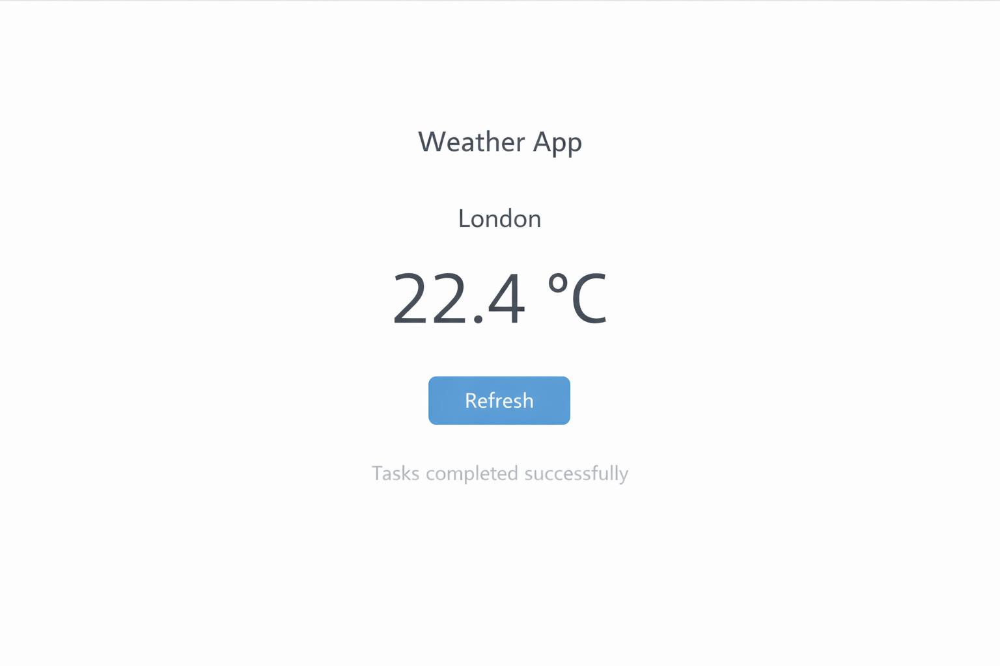
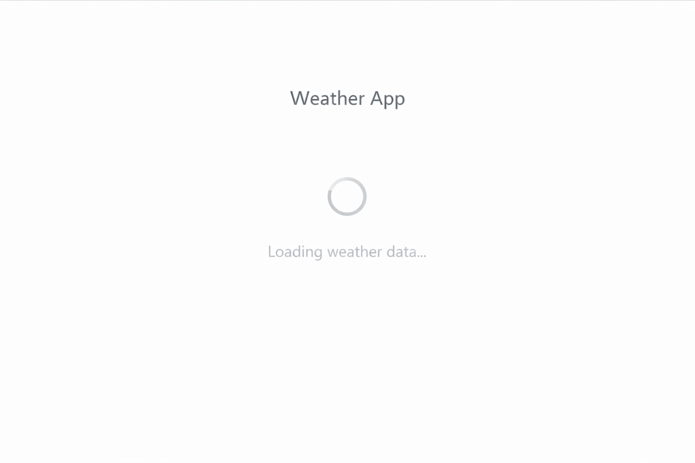
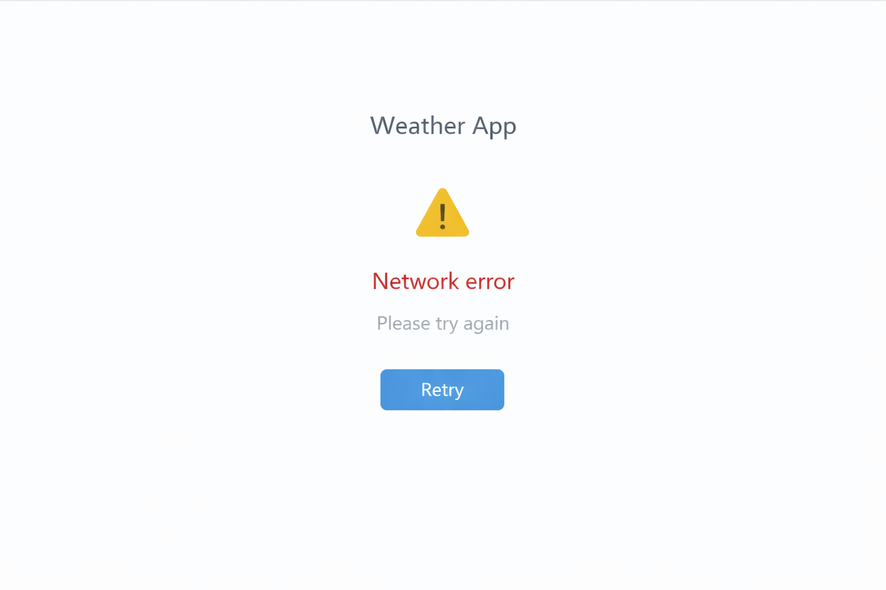

# Weather App

A simple Flutter application that fetches and displays real-time weather data using a public REST API.

## Features
- Fetches current weather data from an external API
- Displays temperature and city information
- Handles loading and error states
- Clean Material UI design

## Tech Stack
- Flutter
- Dart
- REST API
- HTTP package

## Screenshots

| Home | Loading | Error |
|------|---------|-------|
|  |  |  |

## Project Structure
- `lib/main.dart` – UI and API integration logic
- `pubspec.yaml` – Dependencies and configuration

## How to Run
1. Install Flutter SDK
2. Clone this repository
3. Run `flutter pub get`
4. Run `flutter run`
